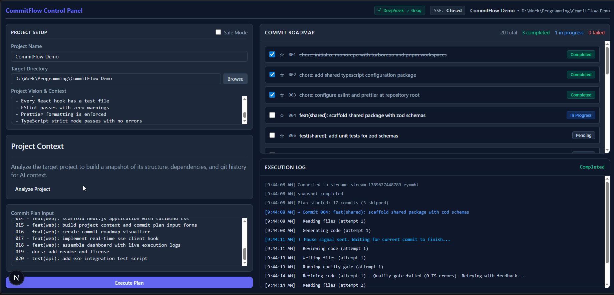
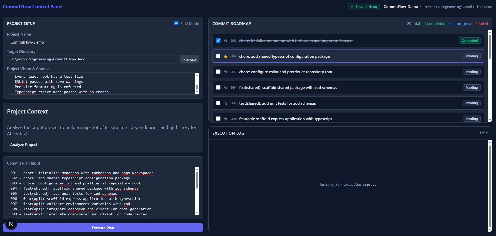
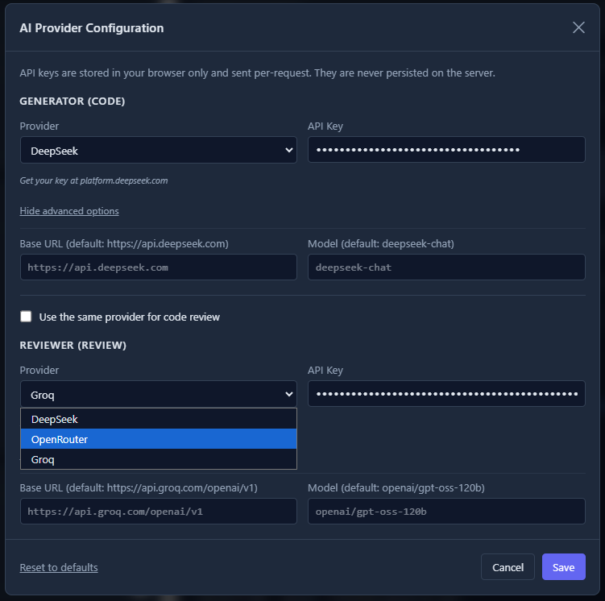
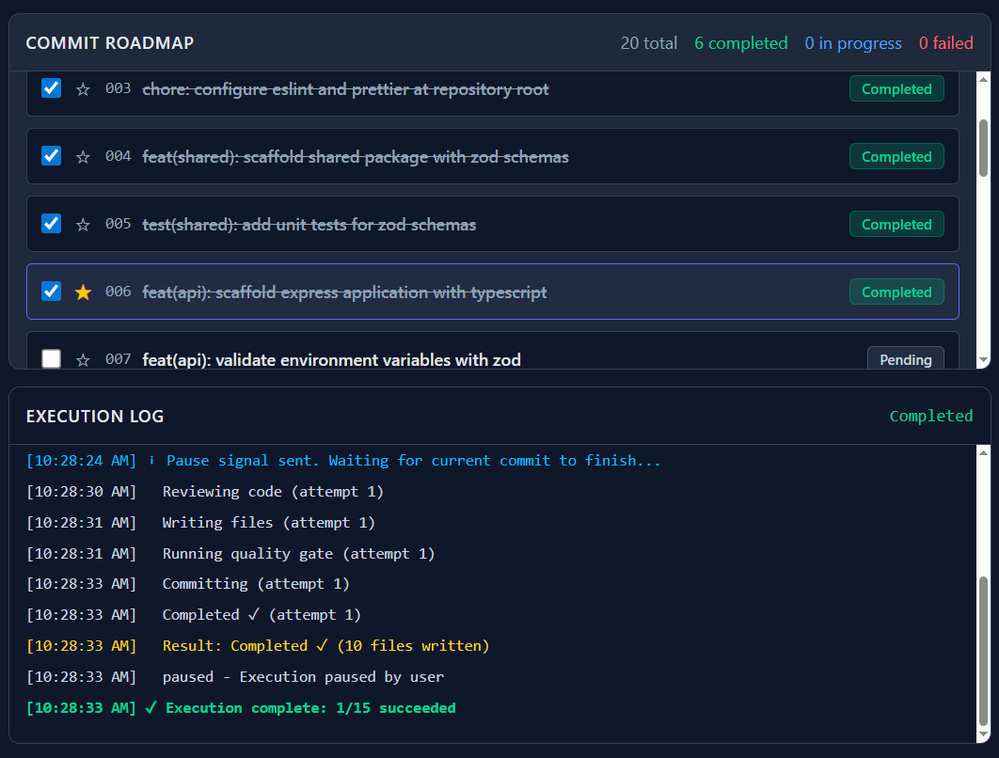

<div align="center">

# 🚀 CommitFlow

> Automated project execution engine with two-agent AI code review.

[](https://github.com/MucahidTech/CommitFlow/actions/workflows/ci.yml)
[](./LICENSE)
[](https://nodejs.org/)
[](https://pnpm.io/)
[](https://turbo.build/)

<br />

<p align="center">
  
  <br />
  <em>End-to-end demo: analyze an existing project, select a target commit, execute live, pause, resume, and re-scan to see the updated roadmap.</em>
  <br />
  <sub>Two agents work in tandem: one generates code, the other reviews it before each commit.</sub>
</p>

</div>

---

**CommitFlow** is a local development tool that receives structured commit plans and executes them atomically. It orchestrates a dual-agent AI pipeline — one agent writes code, another reviews it — enforces strict quality gates, and produces clean git history with one commit per planned step.

The tool runs entirely on your machine and operates on **your local project**, not on a remote server. This makes it suitable for private codebases and offline workflows.

---

## ✨ Key Features

### Core Capabilities

- 📜 **Commit Plan Execution** — Parse and execute structured commit plans as atomic git commits.
- 🤖 **Two-Agent AI Orchestration** — A generator agent writes code while a reviewer agent validates it before application.
- 🛡️ **Quality Gates** — Automatic formatting and TypeScript verification before applying changes.
- 🔄 **Error Feedback Loop** — Self-correcting retries with targeted error feedback on failed checks.

### Context & Control

- 🔍 **Project Snapshot & Context** — Deep scanning of existing projects to detect file structure and tech stack.
- 🎯 **Target Commit Selection** — Start or resume execution from any specific commit in the roadmap.
- ⏸️ **Pause & Resume** — Safely interrupt long-running tasks; state is persisted to `.commitflow/state.json`.
- 🎨 **Multi-Provider Support** — Configure generation and review agents across DeepSeek, OpenRouter, and Groq.
- 🔒 **Safe Mode** — Preview generated changes without committing to git (default: ON).

### Developer Experience

- 📂 **File Context Engine** — Reads and preserves existing file structure to prevent data loss.
- ⚡ **Real-time Progress** — Server-Sent Events (SSE) stream live status to the dashboard.
- 🖥️ **Interactive Dashboard** — Next.js UI with commit roadmap, pause/resume controls, and live logs.
- 🧪 **Layered Testing** — Unit tests, E2E UI tests, E2E API tests, and a full-stack integration test.

---

## 📸 Screenshots & UI Tour

<p align="center">
  
  <br />
  <em>Interactive Dashboard: Project context configuration, plan input, commit roadmap, and live execution terminal.</em>
</p>

<p align="center">
  
  <br />
  <em>Flexible AI Architecture: Configure generator and reviewer models independently (DeepSeek, Groq, OpenRouter).</em>
</p>

<p align="center">
  
  <br />
  <em>Roadmap Tracker: Granular status tracking with real-time SSE execution logs.</em>
</p>

---

## 🏗️ Architecture & Tech Stack

```text
commitflow/
├── .github/workflows/       # CI/CD automation pipelines
├── apps/
│   ├── api/                 # Express server (AI orchestration, Git execution, Quality gates)
│   └── web/                 # Next.js 15 dashboard (Roadmap visualization, SSE live logs)
└── packages/
    ├── shared/              # Zod schemas & inferred TypeScript types
    └── config-typescript/   # Shared TypeScript tooling configurations
```

| Component              | Technology                                                                     |
| ---------------------- | ------------------------------------------------------------------------------ |
| **Monorepo**           | Turborepo + pnpm Workspaces                                                    |
| **Backend & Frontend** | Express 4, Node.js 22+, Next.js 15 (App Router), React 19, Tailwind CSS v4     |
| **AI Providers**       | DeepSeek, OpenRouter, Groq (configurable per role)                             |
| **Shared Layer**       | Zod schemas & inferred TypeScript types                                        |
| **Testing & Quality**  | Vitest, React Testing Library, Playwright, ESLint, Prettier, TypeScript Strict |

---

## 🛠️ How It Works

### Execution Pipeline

```text
1. Context Init  → Scan project path, auto-init git if empty, detect tech stack
2. Plan Submit   → API validates structure via Zod schemas and target commit configuration
3. Generation    → Generator agent reads context and produces changes
4. AI Review     → Reviewer agent inspects code (refines up to 3x)
5. Quality Gate  → Prettier & TypeScript compiler run checks
6. Git Commit    → Rollback on error; apply atomic commit on pass (if Safe Mode OFF)
7. Stream Status → Live updates pushed to dashboard via SSE with Pause/Resume controls
```

### Commit Plan Format

Each line represents an atomic execution step: `ID - type(scope): subject`

```text
001 - feat(shared): scaffold shared package
002 - feat(api): add endpoint
003 - fix(web): resolve render crash
```

| Type        | Purpose           | Examples                                        |
| ----------- | ----------------- | ----------------------------------------------- |
| **Core**    | Features & Fixes  | `feat`, `fix`, `refactor`, `perf`               |
| **Tooling** | Docs, Config & CI | `docs`, `chore`, `test`, `ci`, `build`, `style` |

---

## 🚀 Quick Start

### Prerequisites

- **Node.js** `>= 22.0.0`
- **pnpm** `>= 11.0.0`
- **Git** `>= 2.30`

### Installation

```bash
git clone https://github.com/MucahidTech/CommitFlow.git
cd CommitFlow
pnpm install

# Build shared packages
pnpm build
```

### Environment Setup

Create `apps/api/.env` with **at least one** AI provider key:

```env
NODE_ENV=development
PORT=4000
HOST=0.0.0.0
CORS_ORIGIN=http://localhost:3000

# AI Provider Keys (at least one required for runtime and E2E tests)
GROQ_API_KEY=your_groq_api_key
DEEPSEEK_API_KEY=your_deepseek_api_key
OPENROUTER_API_KEY=your_openrouter_api_key

# Optional provider base URLs
GROQ_BASE_URL=https://api.groq.com/openai/v1
DEEPSEEK_BASE_URL=https://api.deepseek.com
OPENROUTER_BASE_URL=https://openrouter.ai/api/v1
```

Create `apps/web/.env.local`:

```env
NEXT_PUBLIC_API_URL=http://localhost:4000
```

### Run Development Server

```bash
pnpm dev
```

Open **http://localhost:3000** to access the dashboard.

---

## 📖 Documentation

| Document                           | Description                                                  |
| ---------------------------------- | ------------------------------------------------------------ |
| [README](./README.md)              | Overview, quick start, tech stack (this file)                |
| [Usage Guide](./docs/USAGE.md)     | Detailed workflows: snapshots, pause/resume, model selection |
| [Testing Guide](./docs/TESTING.md) | Layered testing strategy and commands                        |
| [License](./LICENSE)               | PolyForm Noncommercial License 1.0.0                         |

---

## 🧪 Testing

CommitFlow uses a layered testing strategy. See [TESTING.md](./docs/TESTING.md) for the full guide.

| Command                | What it runs                                     |
| ---------------------- | ------------------------------------------------ |
| `pnpm test`            | Unit tests across all workspaces (fast, no AI)   |
| `pnpm e2e:web`         | Playwright UI tests (mocked API, no AI)          |
| `pnpm e2e:api`         | E2E API tests (real AI + git, needs keys)        |
| `pnpm e2e:integration` | Full-stack integration test (needs keys)         |
| `pnpm e2e:all`         | All E2E suites (needs keys)                      |
| `pnpm verify`          | Format + lint + typecheck + unit tests + all E2E |

---

## 📜 License

This project is licensed under the **PolyForm Noncommercial License 1.0.0**. See [LICENSE](./LICENSE) for details.

The license permits viewing, learning, and personal non-commercial use. Commercial use, redistribution, and derivative works require explicit written permission.
